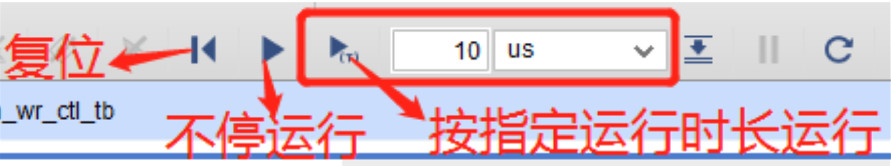

# 问题汇总

1. Vivado崩溃后C盘被占满，再次运行时无法运行

    清除如下文件夹中的所有文件：

    ```
    C:\Users\<你的用户名>\AppData\Local\Temp
    ```

    并清空回收站。

    * 如果仍然不行的话，可以借同学的设备或到机房电脑上做实验；

    * 至于解决仿真文件过大的问题，可以考虑先将波形文件保存在项目中，再进行仿真，或者你也可以参考2中的相关信息，探索减少仿真次数的办法。

2. 仿真无法看到正确波形

    考虑如下可能：

    * 仿真时长不够：

        

        在此处设置运行时长，直到大于`tb`文件中指定的运行时长。

    * 仿真速度太慢
    
        如果你的仿真文件`flash_led_top_tb.v`中的代码是这样的:
        ```verilog
        timescale 1ns / 1ps
        ```

        可以将`tb`文件的第一行改为：

        ```verilog
        `timescale 1ns / 1ns
        ```
        关于这个改动为什么能够起作用，你可以在后续的testbench专题页面进行查看相关知识。

        流水灯的仿真速度不仅与`tb`中的timescale有关,也和流水灯代码有关，**本质原因是counter模块要进行很多很多很多很多很多很多时钟周期之后**，才会产生让LED灯发生变化的信号，你可以思考一下，到底需要多少个时钟周期之后，才能让流水灯变化。想清楚以后，相信你自己一定能找到让流水灯快起来的办法

    * 程序逻辑有问题

        检查程序逻辑，必要时应测试多个模块直到找到问题。

3. 生成比特流失败

    * 检查是否已经`Synthesis`和`implementation`；
    * 检查是否已经分配所有管脚：
        * 在`implementation`完成后点击`open implementation design`界面，随后点击页面最上方的`Layout -> IO Planning`打开管脚分配界面，在其中分配所有管脚，程序中用到的管脚全部要分配，一个都不能少。
        * 如果需要添加管脚约束,在第一次`Synthesis`之后，需要在图形化界面添加管脚约束之后再次`Synthesis`，或者你可以学习如何直接在文件中描述约束

# 验收要求

* Q：可以拍一个视频验收吗？

    A：不可以。验收过程不仅需要看现象，还需要考察一些问题，因此最好不要使用视频验收的方式。如果在自己的电脑上没有相应条件的话，最好能够在上课的时候在机房电脑上做实验并在课上验收。可以用提前录视频的方式展示现象，但是提问环节不能省略。
    
* Q：可以多次验收吗？

    A：每位同学都有不止一次机会，如果你感觉回答的不太好可以提出再给你一次机会，但请不要因此反复验收。

- Q：验收有时间限制吗？

    A：没有，只要能够在课程结束前验收，都没有区别，靠后验收没有什么影响。当然，我们建议尽早验收。

# 回到主页
[主页](https://zhangziqing.github.io/DigitalLogic_Info/)