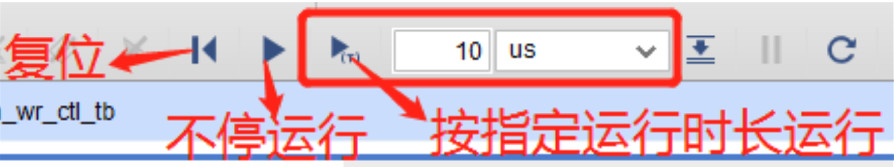
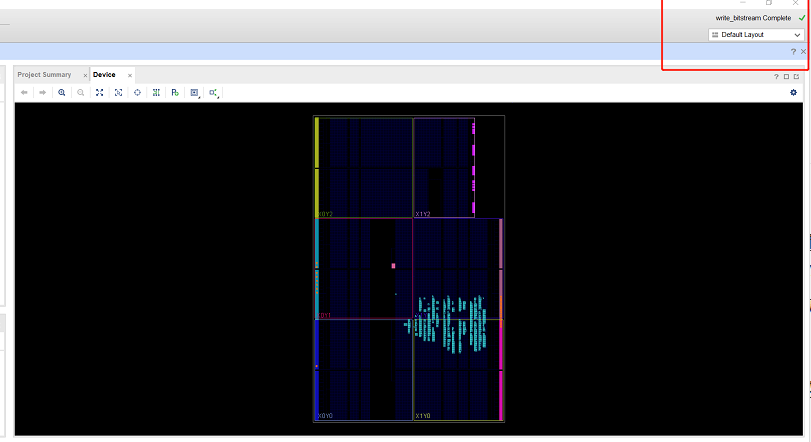
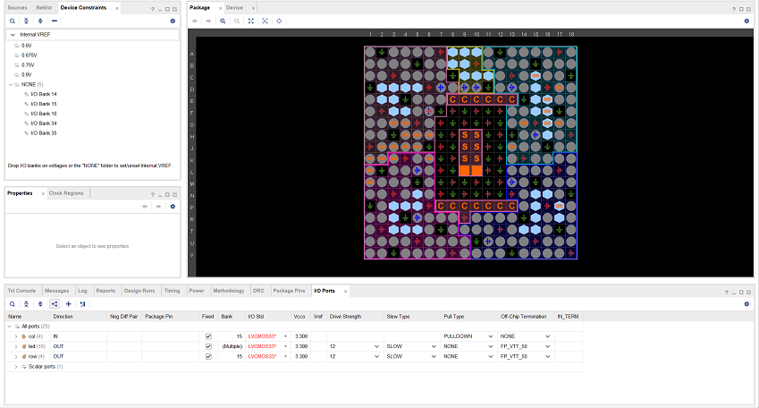

## 问题汇总(又称vivado风水学宝典)

1. Vivado崩溃后C盘被占满，再次运行时无法运行

    清除如下文件夹中的所有文件：

    ```
    C:\Users\<你的用户名>\AppData\Local\Temp
    ```

    并清空回收站。

    * 如果仍然不行的话，可以借同学的设备或到机房电脑上做实验；

    * 至于解决仿真文件过大的问题，可以考虑先将波形文件保存在项目中，再进行仿真，或者你也可以参考2中的相关信息，探索减少仿真次数的办法。

2. 仿真无法看到正确波形

    考虑如下可能：

    * 仿真时长不够：

        

        在此处设置运行时长，直到大于`tb`文件中指定的运行时长。

    * 仿真速度太慢
    
        如果你的仿真文件`flash_led_top_tb.v`中的代码是这样的:
        ```verilog
        timescale 1ns / 1ps
        ```

        可以将`tb`文件的第一行改为：

        ```verilog
        `timescale 1ns / 1ns
        ```
        关于这个改动为什么能够起作用，你可以在后续的testbench专题页面进行查看相关知识。

        流水灯的仿真速度不仅与`tb`中的timescale有关,也和流水灯代码有关，**本质原因是counter模块要进行很多很多很多很多很多很多时钟周期之后**，才会产生让LED灯发生变化的信号，你可以思考一下，到底需要多少个时钟周期之后，才能让流水灯变化。想清楚以后，相信你自己一定能找到让流水灯快起来的办法

    * 程序逻辑有问题

        检查程序逻辑，必要时应测试多个模块直到找到问题。

3. 生成比特流失败

    * 检查是否已经`Synthesis`和`implementation`；
    * 检查是否已经分配所有管脚：
        * 在`implementation`完成后点击`open implementation design`界面，随后点击页面最上方的`Layout -> IO Planning`打开管脚分配界面，在其中分配所有管脚，程序中用到的管脚全部要分配，一个都不能少。
        * 如果需要添加管脚约束,在第一次`Synthesis`之后，需要在图形化界面添加管脚约束之后再次`Synthesis`，或者你可以学习如何直接在文件中描述约束

4. 找不到I/O Ports,不知道哪里设置管脚约束

    综合之后，默认打开的时候下图的layout，点开左上角红框的Default Layout选框，选择I/O Planning，进入管脚分配模式

    

    选择下方标签中的I/O Ports，可以开始愉悦的管脚配置了（

    EGO1的开发板上相关外设的引脚可以查看老师下发资料中的硬件手册

    **tips：**如果发现管脚和硬件手册上的管脚对应不上，不用紧张，因为学校购置的开发板有两批，第二批的开发板引脚和第一版不完全一致，[第二版的硬件手册](/document/Ego1_UserManual_v2.2.pdf ':ignore')可以点击链接下载。

    
    
5. 点击Run Simulation后一直卡在加载条那里

    删除项目目录中的`sim/sim_1`文件夹并重试。

6. vivado玄学崩溃/无法仿真/打不开rtl分析

    首先还是请同学们认真查看vivado的报错，review代码，，查看是否添加约束，排除代码本身的问题。如果实在排查不出问题，可以尝试下述方式。

    关闭vivado，从文件夹打开工程目录。点击`工程目录/你的工程名字.xpr`文件，通过这种方式打开工程，再重复出现问题前的操作，看是否能解决。

    

