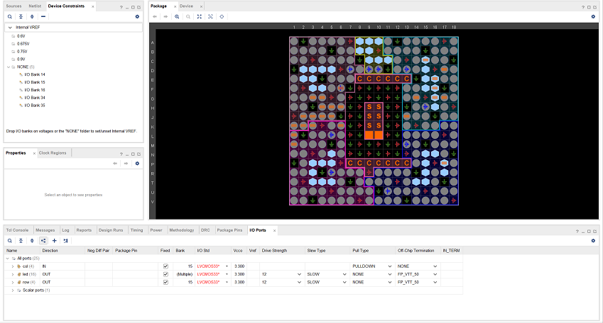
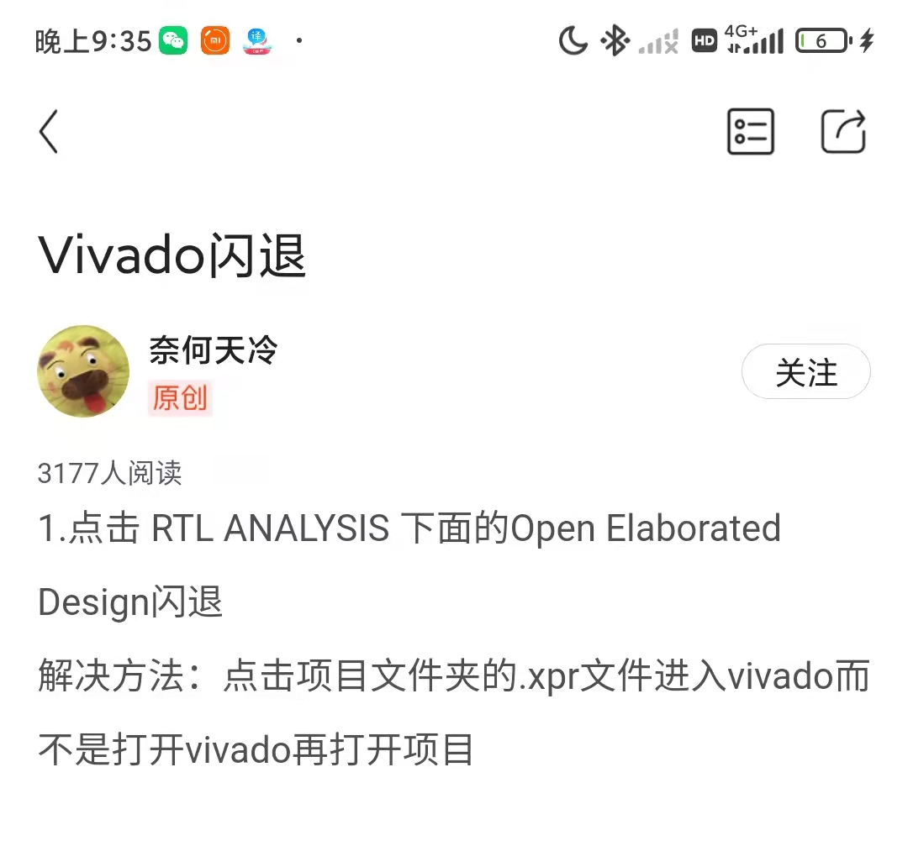
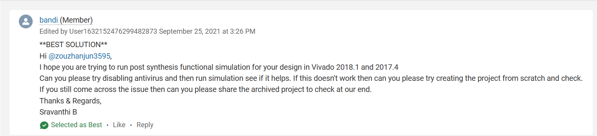

# 常见问题
本文档旨在解答一些新手在学习 verilog 以及进行仿真（simulation）、综合（synthesis）和实现（implementation）过程中遇到的经典问题以及解决方案。

## 在FPGA上开发的流程
在课程使用的 Xilinx 的 FPGA 上，推荐使用 Vivado 进行开发流程。但由于 Vivado 的编辑功能过于薄弱，在此推荐使用 VSCode 进行 RTL 代码的编辑，使用Vivado来进行仿真、综合以及实现的步骤。

具体更换步骤如下：

1. PROJECT MANAGER - Settings
2. Tool Settings - Text Editor
3. Current Editor - Custom Editor - ...
4. 在 Editor 中按照提示输入编辑器的启动指令

## 仿真建议
仿真时，建议打开 log all signals 选项，可以便于在仿真中添加信号而无需重新仿真。

打开方式如下：

1. PROJECT MANAGER - Settings
2. Project Settings - Simulation
3. 勾选 Simulation - xsim.simulate.log_all_signals
4. 关闭仿真界面重新运行

## 波形异常

### 信号为 Z
如果仿真波形中出现了 Z 信号，那么这意味着该信号处于高阻态（High Impedance），即没有被任何信号驱动的开路状态。注意，这与低电平是不同的。

该问题较好排查，通常是信号名称错误（注意，verilog中不前置声明的情况下使用了一个位宽为1的信号不会产生Error）或者是没有驱动该信号的源。

并不是说出现了高阻态一定意味着错误，在调用IP核的过程中，面对不需要的输出可以将其显式留空。

在查找造成 Z 的原因时，应层层追溯到最早的 input 信号，然后修正。位宽不匹配也会造成信号悬空。

### 信号为 X
信号为 X 意为不定态，可能是由于 reg 型变量未被赋值或者是信号冲突（一般是多驱动）导致。**注意，有一些多驱动可能会被 Vivado 自动优化，或者在综合实现的过程中产生错误。这种情况是存在较大风险的。**

在排查 X 信号时，需要层层追溯，直到找到 X 的最早因子进行修复。如果没有该情况，则需要排查多驱动。排查多驱动可以通过综合后查看 Critical Warning 和 Error 来进行。

此外， X | 1 = 1， X & 0 = 0

### 仿真异常停止
这种情况一般是出现了组合逻辑环路。当出现此种情况的时候，建议进行综合，通过 Critical Warning 以及 Error 来查找可能的组合逻辑环路。**这并不一定可靠，Vivado 有时无法检测出组合逻辑环路。**

### 越沿采样
越演采样比较隐蔽，并且通常被认为是设计错误。通常是非阻塞赋值和阻塞赋值混用导致的。请在所有时序逻辑中使用非阻塞赋值，组合逻辑中使用阻塞赋值来解决。

### 波形怪异
如果波形出现了非常诡异的情况，并且排查了 RTL 代码无误后，建议重启 Vivado 或重启电脑。

## 上板仿真不一致
出现这种情况一般是存在越沿采样，或者是时序违约。请降低时钟频率并修正越沿采样。

如果仍然未解决问题，可以遵循如下步骤：

1. 复核生成、下载的bit文件是否正确。
如果判断生成的bit文件不正确，则重新生成bit文件。
如果判断生成的bit文件正确，转步骤2
2. 复核仿真结果是否正确。
如果仿真验证结果不正确4，则回到前面仿真验证步骤。
如果仿真验证结果正确，转步骤3。
3. 检查实现(Implementation)后的时序报告（Vivado界面左侧“IMPLEMENTATION” 
→ “Open Implemented Design” 
→ “Report Timing Summary”）。
如果发现时序不满足，则在Verilog设计里调优不满足的路径，然后回到前面的仿真验证环节依序执行各项操作；或者降低运行频率，即降低pll模块的输出端频率，然后回到前面上板验证环节依序执行各项操作。
如果实现时时序是满足的，转步骤4。
4. 认真排查综合和实现时的Warning。
Critical warning是强烈建议要修正的，warning是建议尽量修正的，然后回到前面上板验证环节依序执行各项操作。
如果没有可修正的Warning了，转步骤5。
5. 人工检查RTL代码，避免多驱动、阻塞赋值乱用、模块端口乱接、时钟复位信号接错、模块调用处的输入输出接反，查看那些从别处模仿来的“酷炫”风格的代码，查找有没有仿真时被force住的值导致仿真和上板不一致……如果怎么看代码都看不出问题，转步骤6。
6. 参考附录C第1节“使用Chipscope在线调试”进行板上在线调试；如果调试了半天仍然无法解决问题，转步骤7。
7. 反思。真的，现在除了反思还能干什么？如果反思之后还无法解决该问题，转步骤8。
8. 冥想。现在除了冥想应该干不了什么了。

## 仿真如何进行
在verilog中，有一些语句是专门为仿真而设计的，是无法综合的。在编写仿真文件时，应注意养成良好的命名习惯 **（这在任何情况下都适用）**，如所有仿真文件都应以 `_tb` 结尾，模块名也推荐以 `_tb` 结尾。这样可以更加清晰地区分仿真文件与其他文件。在仿真中，通常使用 `initial` 语句进行初始化，并使用类似于 `always #5 clk = ~clk` 的语句生成时钟。`$random()` 语句也是生成随机数的好选择。

下面以对8位加法器进行仿真为例，展示仿真文件的书写过程。adder模块只提供了接口。
```verilog
module adder_8_tb();
    reg          clk      ;
    reg  [ 7: 0] add_src_1;
    reg  [ 7: 0] add_src_2;
    reg          add_cin  ;
    wire [ 7: 0] add_res  ;
    wire         add_cout ;

    adder u_adder(
        .src1   ( add_src_1 ),
        .src2   ( add_src_2 ),
        .cin    ( add_cin   ),
        .res    ( add_res   ),
        .cout   ( add_cout  )
    );

    // 进行必要的初始化以及终止条件
    initial begin
        clk        = 'b0;
        #10000 $finish();
    end

    // 时钟生成
    always #5 clk = ~clk;

    // 源操作数生成
    always @(posedge clk) begin
        add_src_1 <= {8{$random()}};
        add_src_2 <= {8{$random()}};
        add_cin   <= {1{$random()}};
    end

    // 正确性判断
    always @(posedge clk) begin
        if((add_src_1 + add_src_2 + add_cin) != {add_cout, add_res}) begin
            $display("ERROR.");
            #5 $finish();
        end
    end
endmodule
```

# 问题汇总(又称vivado风水学宝典)

## 在排查问题之前
   
请不要让vivado可能涉及的任何地方出现任何非**英文字母，数字，下划线**的字符，包括电脑名、用户名、路径等位置！！！

## 为什么我本地测试都是对的, 但提交到OJ总是无法通过

因为你的代码有bug

## Vivado崩溃后C盘被占满，再次运行时无法运行

清除如下文件夹中的所有文件：

```
C:\Users\<你的用户名>\AppData\Local\Temp
```

并清空回收站。

* 如果仍然不行的话，可以借同学的设备或到机房电脑上做实验；

* 至于解决仿真文件过大的问题，可以考虑先将波形文件保存在项目中，再进行仿真，或者你也可以参考2中的相关信息，探索减少仿真次数的办法。

## 仿真无法看到正确波形

考虑如下可能：

* 仿真时长不够：

    

    在此处设置运行时长，直到大于`tb`文件中指定的运行时长。

* 仿真速度太慢

    如果你的仿真文件`flash_led_top_tb.v`中的代码是这样的:
    ```verilog
    timescale 1ns / 1ps
    ```

    可以将`tb`文件的第一行改为：

    ```verilog
    `timescale 1ns / 1ns
    ```
    关于这个改动为什么能够起作用，你可以在后续的testbench专题页面进行查看相关知识。

    流水灯的仿真速度不仅与`tb`中的timescale有关,也和流水灯代码有关，**本质原因是counter模块要进行很多很多很多很多很多很多时钟周期之后**，才会产生让LED灯发生变化的信号，你可以思考一下，到底需要多少个时钟周期之后，才能让流水灯变化。想清楚以后，相信你自己一定能找到让流水灯快起来的办法

* 程序逻辑有问题

    检查程序逻辑，必要时应测试多个模块直到找到问题。

## 生成比特流失败

  * 检查是否已经`Synthesis`和`implementation`；
  * 检查是否已经分配所有管脚：
      * 在`implementation`完成后点击`open implementation design`界面，随后点击页面最上方的`Layout -> IO Planning`打开管脚分配界面，在其中分配所有管脚，程序中用到的管脚全部要分配，一个都不能少。
      * 如果需要添加管脚约束,在第一次`Synthesis`之后，需要在图形化界面添加管脚约束之后再次`Synthesis`，或者你可以学习如何直接在文件中描述约束

## 找不到I/O Ports,不知道哪里设置管脚约束

综合之后，默认打开的时候下图的layout，点开左上角红框的Default Layout选框，选择I/O Planning，进入管脚分配模式


选择下方标签中的I/O Ports，可以开始愉悦的管脚配置了（

EGO1的开发板上相关外设的引脚可以查看老师下发资料中的硬件手册

**tips：**如果发现管脚和硬件手册上的管脚对应不上，不用紧张，因为学校购置的开发板有两批，第二批的开发板引脚和第一版不完全一致，[第二版的硬件手册](/document/Ego1_UserManual_v2.2.pdf ':ignore')可以点击链接下载。


    
## 点击Run Simulation后一直卡在加载条那里

删除项目目录中的`sim/sim_1`文件夹并重试。

## vivado玄学崩溃/无法仿真/打不开rtl分析

首先还是请同学们认真查看vivado的报错，review代码，，查看是否添加约束，排除代码本身的问题。如果实在排查不出问题，可以尝试下述方式。

关闭vivado，从文件夹打开工程目录。点击`工程目录/你的工程名字.xpr`文件，通过这种方式打开工程，再重复出现问题前的操作，看是否能解决。



---

**以下为投稿部分**

---

## 关于VIVADO仿真时找不到子文件的问题及解决办法
> 本问题提供者：计221陈铎友

​	仿真时出现这种现象，是一个问题很模糊的报错


我们按照提示找到下方Tcl Console中查看具体问题


*问题描述*

```
ERROR:[Simtcl 6-50] Simulation engine failed to start: Failed to launch child process (child exe not found).
```

可以看到只有一条有问题描述的报错，Failed to launch child process (child exe not found)，让人摸不着头脑。上网搜了大量的资料，除了Xilinx官网有类似的搜索结果，只有一条中文提问。



可以看到官方给的回答很模糊，都是关闭防火墙啊之类的，当然这个是需要注意的。只是笔者不是这个问题

那么只好研究唯一的一篇中文资料


可以看到这篇问题描述是和我们遇到的情况是一模一样的，所以看到下方的回答，只有重装系统是有效的~~（但是这是不懂电脑的人干的事）~~，所以我怀疑是环境变量的配置出现问题，而不是vivado本身的问题。因此回去翻看Tcl Console中列出的Info：


发现中间虽然没有ERROR，但是有一条可疑的WARNING，可以看到这两个PATH正是环境变量中的元素，有理由怀疑是他们出现了冲突或者问题

所以我选择**在备份下他们的情况下**在环境变量中把他们删除（**注意备份！！！！**）


删除之后再运行，果然问题得到解决...

回想这两个环境变量元素到底是什么，其实是我在配置Vscode的c环境时候留下的，因此大多数人都不会遇到这种问题，算是一个巧合。

## 七段数码管引脚对应问题
> 本问题提供者：物联221黄意凡  

  
红框里面对应前4个数码管BIT1，BIT2,BIT3,BIT4，蓝框里面对应后4个数码管BIT5,BIT6,BIT7,BIT8；  

前四个数码管和后四个数码管的细管对应的引脚不相同  

前四个7位数码管引脚  

  

后四个7位数码管引脚  


**1.在参考本文时请务必看清楚问题描述，造成仿真失败的原因很多很多，务必确定自己遇到情况和本文相同！！！**

**2.修改环境变量之前请务必记得备份，*可以使用把他们复制到新建文本文件的方法 orz***


