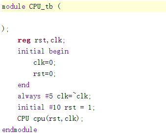
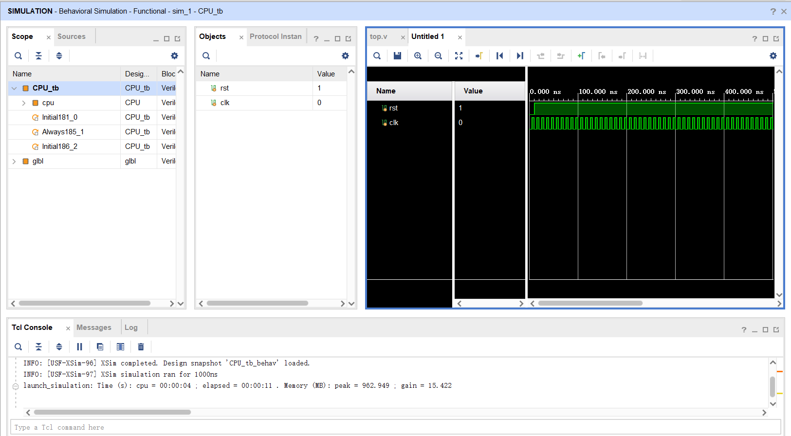
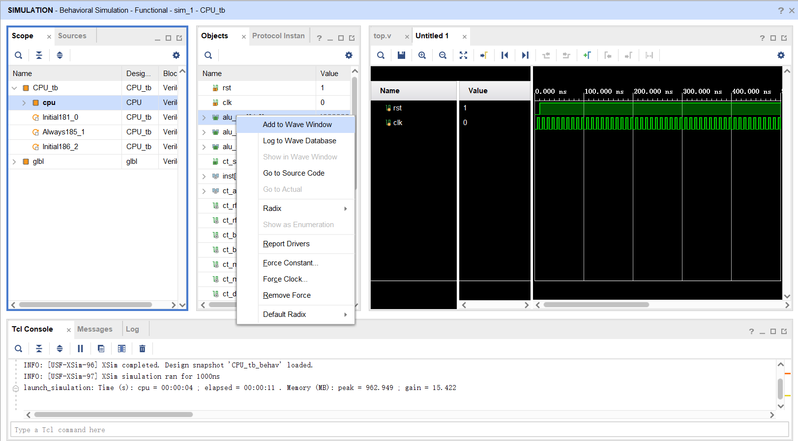
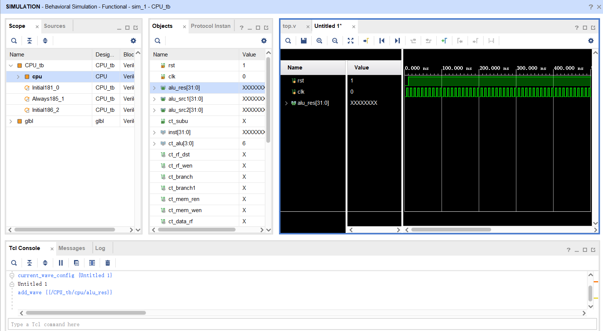
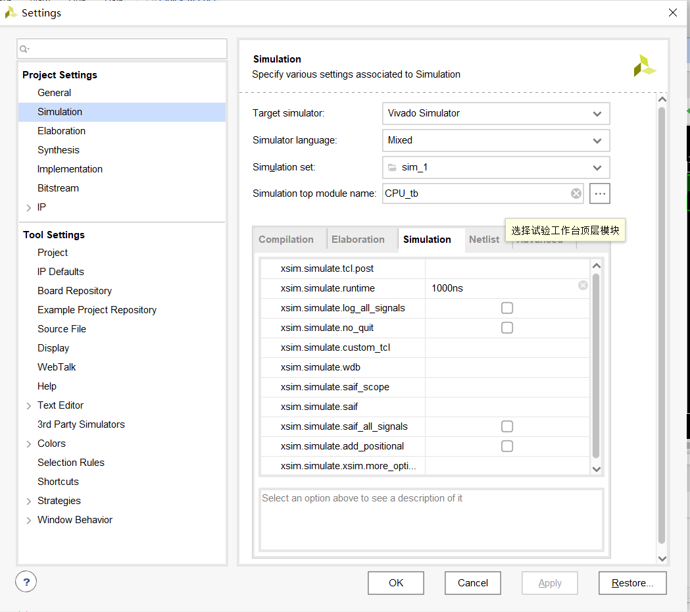

# Simulation使用帮助

> by Zakilim

在数字逻辑课程中我们已经对与仿真功能有了一定的认识，（尽管有很多同学倾向于直接综合上板），在复杂数字系统的开发中，由于系统本身较为复杂，电路对于综合器来说较为抽象，综合会耗费大量的时间。仿真在数字逻辑设计中显得尤为必要，下面介绍一些关于仿真的技巧。

## 内部信号的监测

 默认情况下，vivado的波形窗口默认只会会显示顶层模块中的信号，比如我们仿真一个CPU（暂不考虑输出），顶层的仿真文件里只有clk和rst两个信号

直接运行，波形中会只有两个信号，此时我们可以点击左侧的Scope，在模块列表中点击想要查看内部信号的模块，就可以在object一栏中找到该模块中的所有信号，这时候只需要右击信号点击add wave to window即可在右侧的看到被添加的波形信号

从图中可以看到，虽然我们将信号加入了波形窗口，但信号却没有显示，这是因为这些信号在一开始的仿真中并没有被记录。这时候可以点击上方的Relaunch Simulation按钮（就是那个重启的小圆圈），就可以看到信号的波形了。

或者我们也可以在开始仿真之前设置一下，在左侧的Project Manager中选择setting，在Simulation界面中勾选log_all_signals，这样我们在将信号添加至波形窗口中也就不再需要relaunch，是一个极其高效的设置。

## 常见异常信号

信号像水流一般在电路中流淌，当我们的结果出现问题时，需要做的当然是对故障的信号进行溯源，当结果出现问题时，我们可以去查看该结果的源头，比如它的控制信号。比如在设计ALU的时候我们发现ALU的加法输出的结果不对，这时候就可以考虑控制信号是否有错，将信号添加到波形窗口中进行查看，一步步溯源，最终排除故障

以下列出两种常见的故障可能的产生原因：

### 高阻Z

Z信号在vivado中代表高阻，以蓝色线显示，高阻在我们的电路中出现一般是出现了输入悬空，包括

* 未对信号进行赋值，wire类型的默认值时Z，若为赋值则会出现高阻
* 未向模块提供信号，比如扩展指令的时候增加了模块的接口却忘记给其提供信号
* 对于多位信号，**输入的位数少于模块端口需要的位数**

### 不定值X

不定值出现的原因很多，包括

* **reg类型信号未被赋值，默认为X**,在写状态机的时候尤为常见，建议做好复位功能
* **多驱动电路**，多个变量对同一个变量进行赋值

### 字母abcdef

只是16进制而已，不用太惊讶