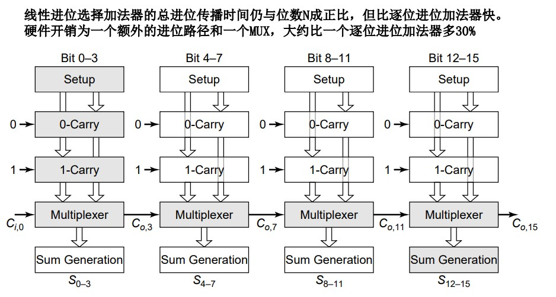
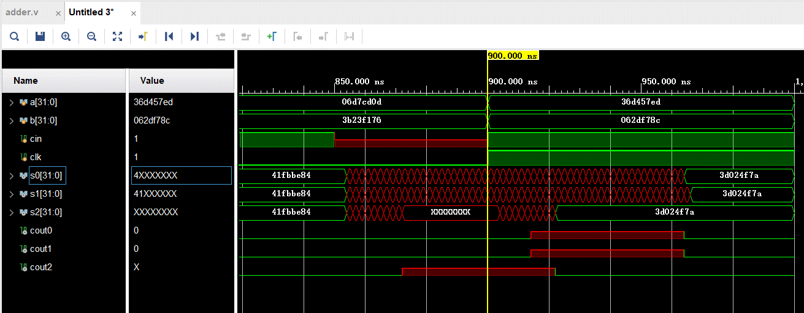

# lab2 Write-up
> by Zakilim

实验二的内容包括两个，一个是数码管的显示，一个是加法器的设计。

## 数码管显示

数码管的显示这个实验，核心代码是一个简单的译码器电路，将按键输入的4位二进制数译码为8位的数码管显示电路控制信号。

### 数码管显示原理

EGO1上提供了两组数码管，每组数码管包括4个数码管，每个数目管事实上是8个LED组成，每组的每一个LED通过同一个信号进行控制。这样一组控制信号称为段选信号，用于控制数码管显示的字符形状。

### 译码电路的显示

译码电路是一种简单的组合逻辑，在代码中，组合逻辑往往有两种写法，一种是通过`assign`语句，一种是通过一种特殊的`always @(*)`。

两种写法理论都可行，需要注意的是`always`语句中只有`reg`类型能被赋值。所以被声明对象必须要被声明为`reg`类型。需要注意的一点是，如果在`always@(*)`这种语块中，未能将所有的情况全部覆盖，比如经典的写`if`不写`else`，这就会导致锁存(Latch)，这样就导致电路的变化与我们预期的不符，所以在采用`always`写组合逻辑的话，一定要注意`always`语块本身的特殊性。

!> 注意reg   注意latch

这种情况的产生原因是因为`Verilog`本身未划清用于组合逻辑的`always`和用于时序逻辑的`always`。在System Verilog当中，为了区别这一点，它引入了`always_comb`和`always_ff`用于区分时序逻辑和组合逻辑。

那么如果在Verilog中，除了注意写`else`和`default`，还有没有办法能够保证不出现Latch呢？答案当然是有的。解决方法就是，把所有的组合逻辑`always`语块，换成`assign`语句:

```verilog
assign seg = (num == 4'd0) ? 8'b0011_1111:
             (num == 4'd1) ? 8'b0101_1011:
             (num == 4'd2) ? 8'b0100_1111:
             (num == 4'd3) ? 8'b0100_1111:
             (num == 4'd4) ? 8'b0110_0110:
             (num == 4'd5) ? 8'b0110_1101:
             (num == 4'd6) ? 8'b0111_1101:
             (num == 4'd7) ? 8'b0000_0111:
             (num == 4'd8) ? 8'b0111_1111:
             (num == 4'd9) ? 8'b0110_1111:
                                          8'b0000_0000;
```
这种写法较之`always`，解决了必须要声明为`reg`和可能产生`latch`两大痛点,我本人非常喜欢（

> 更多写法欢迎参考附录中的《计算机组成原理设计指导书——Verilog部分》

## 加法器时延计算

在实验资料包中给出了这样一个全加器，这个加法器模拟了门电路搭成的加法器的时延。

```verilog
module add1(
	input a,
	input b,
	input cin,
	output sum,
	output cout);
	assign #4 sum = a ^ b ^ cin;
	assign #2 cout =  (cin==1)|(cin==0)?(a & cin) | (b & cin)| (a & b):1'bx;
endmodule
```

本实验的主要目的在于帮助大家理解串行进位加法器和选择进位加法器的运算时延，希望大家能够明白，电路中是存在延迟的，尽管我们课程中设计的电路中很少会需要考虑时延，但是在真正的高性能电路当中，每一点时延都非常重要，分析电路的时延传播的关键路径，非常的重要。

### `generate for`

串行进位加法器的每一个全加器接受前一级加法器传来的进位，计算出进位信号并输给下一级，这就是串行进位加法器的工作流程。

在完成该实验的过程中，可以看到很多同学采用了直接列出32个加法器的方式完成。
>说真的列出32个加法器的同学不会觉得累吗...

一种解决方案是，1变2，2变4，4变8，如此组装成一个大的加法器。

另一种方式则是利用`for`语句，for语句的使用需要理解一点，**for语句的含义是电路模块的重复而非电路动作的序列重复。**

以下面的代码为例

```verilog
 module rcadd32(
    input [31:0]a,
    input [31:0]b,
    input cin,
    output [31:0]sum,
    output cout
);
    wire [32:0] c;
    genvar i;
    assign c[0] = cin;
    assign cout = c[32];
    generate
        for (i=0;i < 32;i=i+1)
        begin:add
            add1 a(a[i],b[i],c[i],sum[i],c[i+1]); 
        end
    endgenerate   
endmodule
```
这段代码的效果事实上与手动列出32个加法器的效果是等效的。这种`for`循环被称为生成for(generate-for)，专门用于实例化元件，其中`generate`和`endgenerate`中间包裹的语块被称为生成块，与`always`块和`initial`块为代表的过程块相对应。过程块描述电路的行为，而生成块描述电路结构。

!> 使用for语句必须明确该语句并非被综合成一个循环，无论是此处的generate for还是某些同学可能用到的在always语块当中使用的for


### 串行进位加法器(Ripple-Carry Adder)时延分析

串行加法器的时延分析非常简单。基于一个简单的事实，串行加法器计算完成的标志是最后一位全加器计算完成，而要保证最后一级加法器计算的结果是正确的，就需要等到前面的全加器的进位信号传递到最后一级，因此，串行进位加法器的计算公式如下

$$T_{rc} = (n-1)T_{carry}+T_{sum}$$

考虑上面的一位全加器中的时延，可以计算出32位串行进位加法器的时延为$(32 - 1) \times 2 + 4 = 66$

### 选择进位加法器(Carry-Select Adder)时延分析

很多同学在验收的时候，最后展示出来的是一个每位进行一次选择的加法器，而且最终似乎确实看到了选择进位加法器在数字到达后的波动比选择进位加法器小很多。

但是事实上这是错误的。如果是每位选择，选择进位加法器的性能甚至不一定会比串行加法器性能更好。

事实上，选择进位加法器一般是将n位加法器进行分组，组内串行进位，组间选择进位。



> 引用一张ppt里的图，所以还不赶紧看ppt复习吗

ppt给出了这样一个公式

$$T_{csadder} = t_{setup} + \frac NM t_{carry}+ Mt_{mux}+t_{sum}$$


为了真正验证选择加法器的时延，我们重新为选择进位加法器加上两个单位的延迟，为了保证选择进位加法器正常工作，与上图不同的地方在于**第一个组加法器是不包含选择的**。以下的公式推导也基于这一点。

考虑到很多同学财大气粗事实上是在一个选择进位加法器里放了两个adder，所以实际的延迟公式和上面的有出入，比上面的计算出的时延应该会稍小一些。

考虑最后一组加法器，在进位信号到来是已经将结果计算完成，等待前面的各组选择器将时延传过来，每一个选择器的时延是$t_{mux}$，那么所有的时延就是$(\frac NM - 1)t_{mux}$，第一个加法器传出的进位信号有效，需要等到其组内的信号传递结束，也就是需要等待一个$MT_{carry}$的时间。总结时延公式如下。

$$T_{csadder} = Mt_{carry} + (\frac NM-1) t_{Mux}$$

很多同学事实上忽略了很重要的一点，选择器也是有时延的。一个选择器是两级门电路，一级与门一级或门。所以如果考虑选择器的时延，它的时延与串行进位加法器进位产生的时延是一致的。如果每个加法器进行一次选择，最高一级加法器确定结果需要等待前面31位加法器的选择，也就是62个门电路的延迟。有没有感觉到很熟悉? 跟串行的加法器一模一样。如果分组过细，比如一个一组，可能带来的性能提升有限。

考虑延迟以后，每组的性能如下,上面一行是每组选择的选择加法器，测得延迟为64ns，下面一行是逐位加法器，延迟66ns，显然，没怎么快。

最下面一行是分成8组的选择进位加法器，测得时延为$22ns = 7\times2 + 4\times 2$与预期一致



选择进位加法器为什么能够带来效率的提升呢？

选择进位加法器经过分组后，后面的每一个组并不需要依赖于前一个组的进位信号传入，而是将两种可能的结果计算一遍，而等前面一级的进位信号来时，只要选择正确的输出即可。


