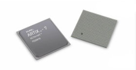
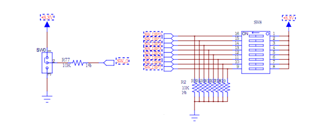
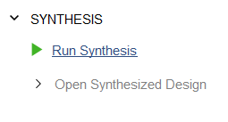
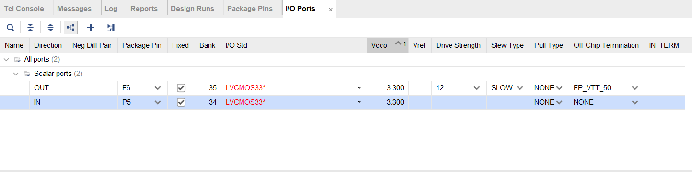

# Lab0：从零开始的FPGA生活

> 多年以后，面对Vivado Error，*Zakilim*将会回想起老师带他去见识EGO1的那个遥远的下午

当你第一次进入数逻实验的课堂，你就会拿到这个红色小盒子装上的FPGA开发板——EGO1。而开发板中央的那块芯片，就是大名鼎鼎的FPGA。你已经在数逻的第一章学到过，FPGA是一种可编程电路，就像你痛恨的数电实验箱一样。但是不用担心，FPGA开发板比数电实验箱更为健壮，很少出现实验硬件故障的问题。不过不用担心自己无法充分受到调试错误的训练，vivado很好的接替数电实验箱完成了这一职责，所以当你遇到Vivado出现问题时，请不要慌张，可以查阅本网站中的[常见问题](Problems)，去各类搜索引擎上搜索，或者你也可以找到你的助教,向他们咨询问题。

> 当然，助教很忙，所以请稍稍体谅一下他们。在问之前思考一下你要问的问题，不要问太蠢的问题。

## 实验0：任务要求与实验原理

说回正题，数字逻辑实验课程围绕着FPGA开发板展开，你需要做的就是通过编写Verilog设计电路，用Vivado将你设计的电路变成可以下载到FPGA开发板上的比特流，从而操控板上的外设。为了帮助同学们更好的理解如何利用Vivado开发FPGA这一过程，我们准备了Lab0，一个目前未得到官方承认，不计入实验分数，但是或许似乎还有那么点用的实验。这个实验的描述如下。

?>  请你用开发板完成这样一个电路：用户可以通过板上的一个拨码开关，操控板上的一个LED灯。


听起来非常简单，以你自初中以来6年电路经验，你一定明白，最简单的方式就是——把拨码开关和LED灯连起来。事实上，LED灯，拨码开关，FPGA的关系可以通过下面这张图来解释。


开关和LED灯之间通过一个FPGA这样一个黑盒连接，而FPGA作为一块可编程逻辑芯片，你只要可以任意配置其内部的逻辑。所以本实验需要编写的Verilog代码如下

```verilog
module connect(
	input sw,
    output led
);
    assign led = sw;
endmodule
```

这或许会是你在数字逻辑课程里见过的最简单的代码，他只是简单将两个管脚连接起来。但是sw和led着两个信号又是怎么来的呢？connect这个模块不被任何其他模块所实例化，我们称之为顶层模块。在FPGA开发中，顶层模块的接口一般连接到FPGA芯片的管脚上，而这些管脚又连接着不同的外设，所以sw和led事实上对应着FPGA芯片的某个管脚。我们把这块FPGA芯片从这块价值1000元的开发板"抠"下来。



可以看到，FPGA看起来就是一个平平无奇的小方片，上面有着很多很多的管脚，每个管脚本来都连接着开发板上的一个触点，通过触点连接到各种各样的外设，比如说拨码开关，LED灯。板上的按键。FPGA的管脚如此之多，几乎每个管脚都有其用武之地，那么哪个管脚才对应着LED灯和拨码开关呢？关于这点，我们可以打开ego1开发板的[手册](document/Ego1_UserManual_v2.2.pdf ':ignore ')。其中有这样两个表格。


其中第一列`名称`，这是手册给开关或LED起的名字，第二列`原理图标号`，这是电路原理图给开关或LED起的名字。电路原理图描述了电路元件如何与其他部件相连，比如下图就是拨码开关的原理图:



而第三列`FPGA IO PIN`则是FPGA厂商为FPGA上的针脚起的名字，FPGA上的管脚采用类似棋盘的命名方式，比如第K行的3列就对应了FPGA的K3管脚，他连接着一个板上的一个LED灯。


实验手册中的这些表格描述了FPGA芯片管脚与外设管脚的连接关系，所以本实验的主要内容事实上是根据实验手册建立这样的映射关系。

手册之中还有更多的外设与FPGA管脚的映射关系，接下来的实验当中，你还会用到各种各样的外设，这本简短的手册还将发挥更大的作用。

## 实验步骤

0. 安装Vivado

1. 首先，打开Vivado, 在Quick Start部分点击Create Project

   

2. 点击Next进入选择路径的页面，选择项目名称和任意你喜欢的路径，但是路径不要带中文也不要过长。

   

3. 选择项目类型`RTL Project`

   

4. 添加源文件和约束（可以跳过）

   

   

5. 接下来是选择板子的型号，不同的FPGA的资源数量，速度，管脚功能都是不同的，一定一定要选择本课程使用的FPGA芯片`xc7a35tcsg324`。


6. 点击Finish，完成工程创建。

   > 恭喜你完成第一阶段——创建工程

7. 进入vivado，界面如下所示，

   

8. 创建设计文件

   1. 点击下面的加号

      

   2. 点开后，我们会看到下面的界面，其中包括三个部分，分别是

      * 创建或添加约束（Constraints）,添加IO管脚约束和时序约束，这些我们会在后面谈到。

      * 创建或增加设计文件（design sources），设计电路的Verilog文件都是设计文件
      * 创建或增加仿真文件（simulation sources），主要是电路的仿真激励。

      

   3. 你可以选择添加现有文件或目录，或者你也可以创建新文件。这里我们创建一个新文件

      

      

   4. 添加完文件后选择Finish

9. 编写文件代码，把上面的代码放到Vivado中。

   

10. 接下来点击综合，将这个Verilog文件变成网表文件。这里通过在“Flow Navigator”栏中的“Synthesis”下点击“Run Synthesis”。右上角的进度条 “Running synth_design”指示正在对工程进行综合。

    

    

    

11. 等待综合结束，下面的界面弹出,在弹出的对话框中选择“Open Synthesized Design”，并点击“OK”， 打开综合后的工程。

    

12. 我们要对sw和led进行绑定，将其绑定到对应的实际管脚上。对管脚的物理属性进行约束，在“I/O Ports”窗口中对输入输出信号添加管脚约束。首先在“I/O Std”一栏通过 下拉按钮选择“LVCOMS33”，将所有信号的电平标准设置 3.3V。在“Package Pin”一栏分配各个信号在 FPGA 芯片上引脚的位置，各信号的具体位置可查看板卡的原理图。

    1. 

       

13. 点击保存，会弹出一个保存约束文件的选项。这个文件是实际上起到了对IO进行约束的文件。

    

    14. 完成后点击Implemention和Generate Bitstream,生成bit流

    15. 用USB Type C连接板卡和电脑，打开板卡开关。打开Hardware Manger，点击Open Target，Auto Connect

        

        16. 点击Program device

            

            

14. 拨动板卡的对应的开关，看看是不是能正常控制LED灯的亮灭呢

## Lab0后日谈

本实验的主要工作就是带大家熟悉一下Vivado的工作流程，理解一下Vivado设计过程中时序约束的概念。

在本实验当中呢，由于电路模块非常简单，所以我们采用直接综合实现上板的方式，但是在实际的开发中，我们的电路往往不会这么简单，综合和实现都会耗费巨大的时间，然而最终获得电路设计却往往可能存在错误，所以我们需要对电路进行仿真，通过模拟的方式，模拟输入信号，观察输出结果。后面的实验中，大家将会了解到仿真验证电路的方法。