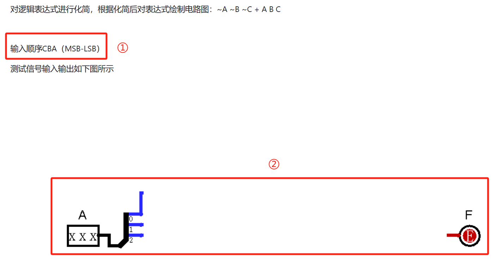
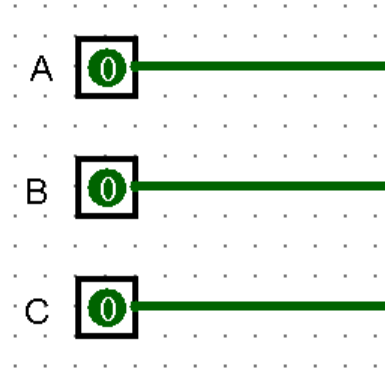
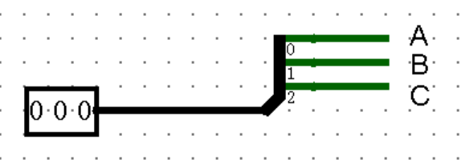
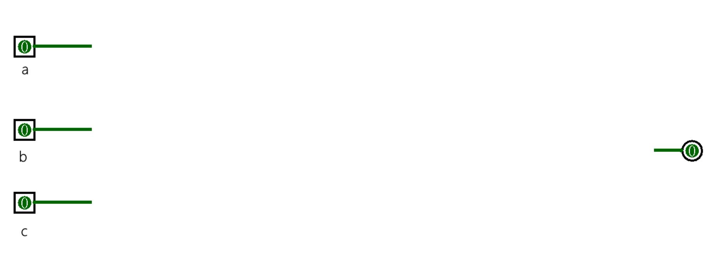
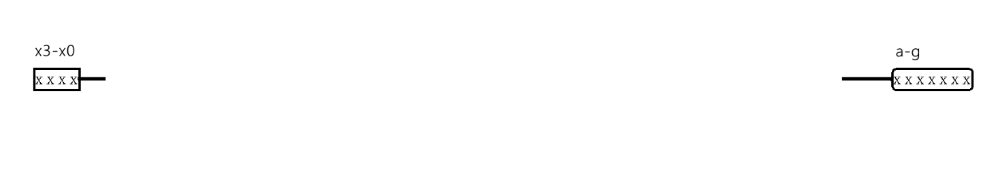
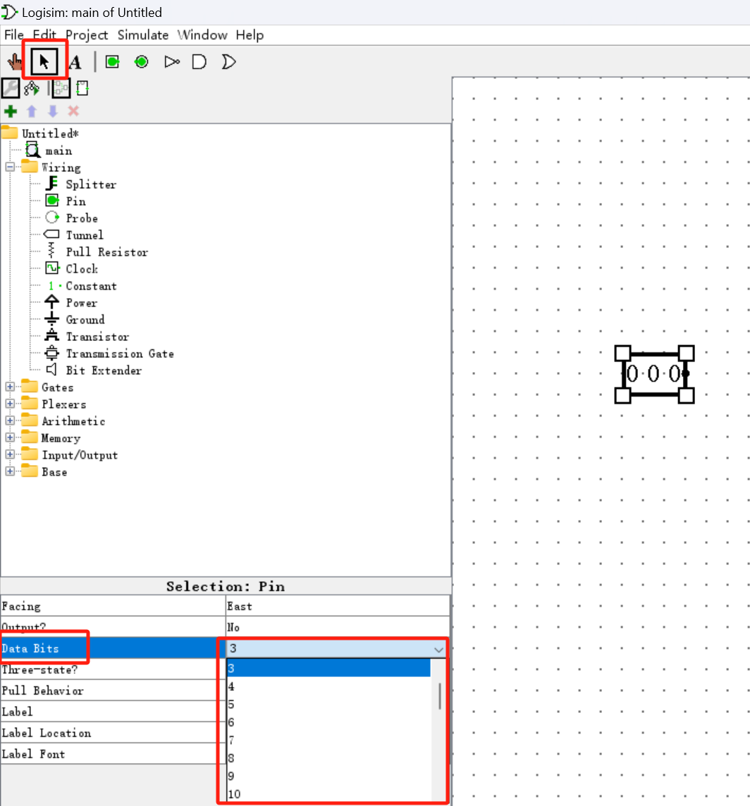
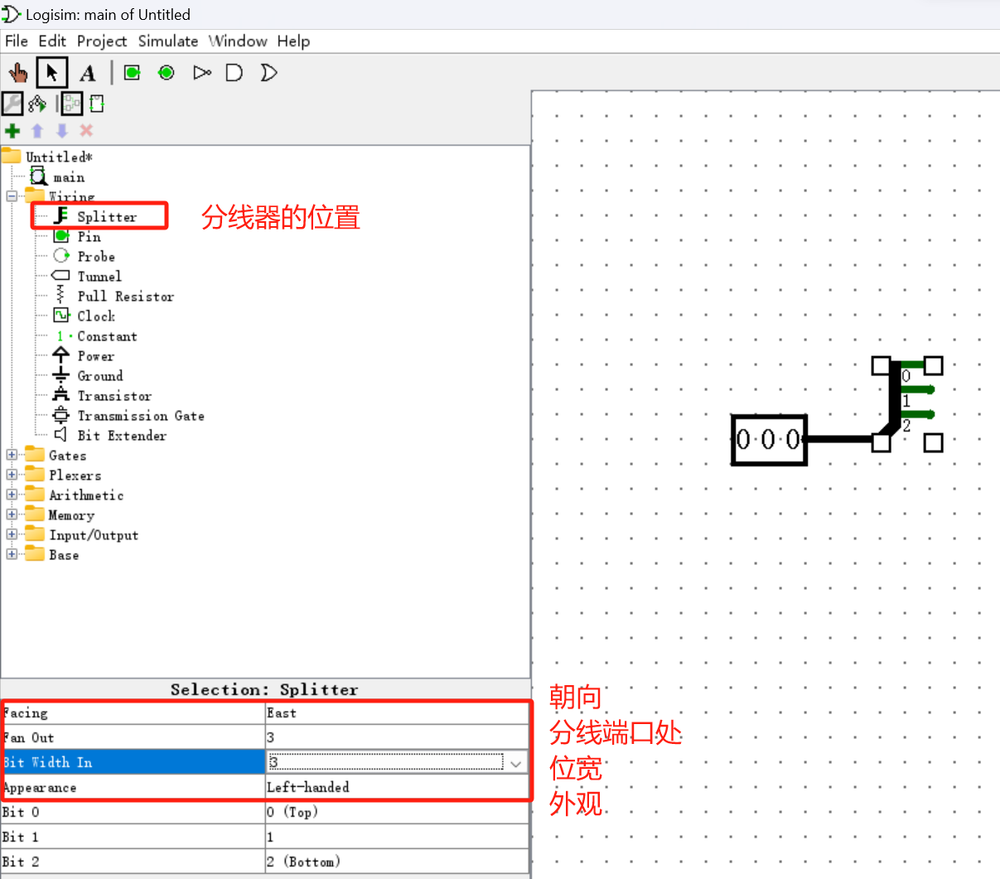
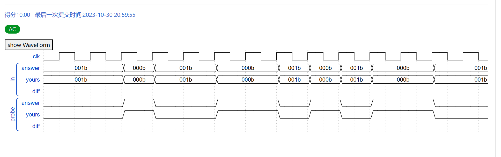
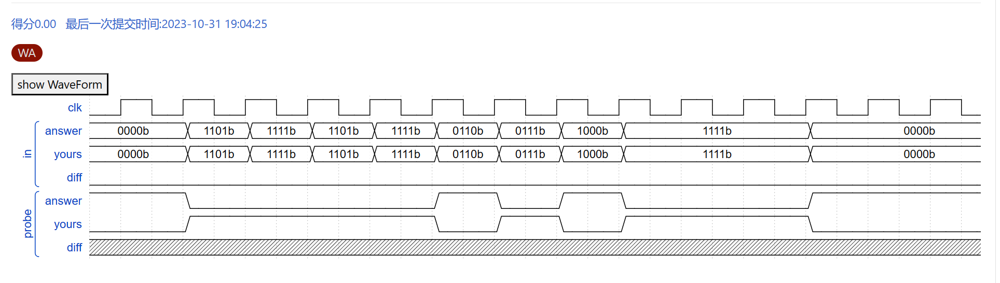
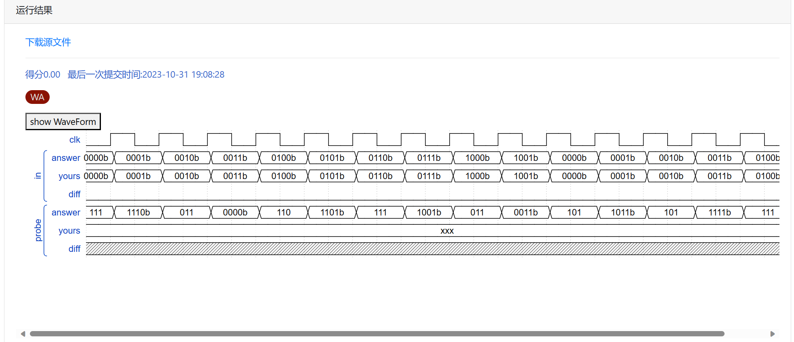

## Homework 1 Q&A
### Logisim 软件使用
#### 安装Logisim
.jar文件的类型为Executable Jar File (.jar)，可以直接双击执行，但是运行.jar需要安装相应的java环境。如果你的电脑没有java环境，可以参考链接的文章安装java环境：
https://blog.csdn.net/and_then111/article/details/87279792

#### 基本使用方法
Logisim安装包中含有两个文档，tutorial文档是全英文的logisim教程，第二个文档中包含了logisim基本的使用方法。

如果你想深入了解logisim的使用，可以在网络上搜索相关教程，找到适合自己的教程进行学习，在此附上两个我常用的教程：
https://soc.ustc.edu.cn/Digital/lab0/logisim/
https://blog.csdn.net/RuanFun/article/details/130795720

### 作业补充
#### 示例
在此以第一题为例进行分析：
将题干中的信息分为两部分：
- 输入顺序的含义；
- 测试信号输入输出

##### 输入顺序的含义
当以一位宽做输入时，输入顺序CBA（默认由高到低）体现在电路图中如图所示

当以多位宽做输入时，如图所示：

##### 测试信号的输入输出
单击工具栏中的输入工具（ ）和输出工具（ ），再点击画布，直接能得到一位宽的输入和输出。

下面向大家介绍多位宽的输入和输出。

首先点击工具栏中的输入工具（  ），再点击画布，然后点击选择工具（  ），再点击左下角的 “Data Bits” 更改数据位宽，即输入不同的位数。
 
得到多位输入后，可以使用分线器将输入分离成多个一位数据，便于后续对输入的计算。
 
输出与输入方法基本一致，在此就不赘述了。

#### 错误分析
Cg是以波形图的方式对提交的题目进行版判断，所以一旦有一项输出与答案不符，那么本题得分即为0分，如果波形完全匹配，即可得到全部分数，如图所示
 
下面向大家简单介绍如何看波形图，以上图为例：
“In”为输入，第一题的输入顺序为CBA（MSB-LSB），那么结合2.1实例，我们可以知道波形图中的001，对应输入ABC→001，此时没有电流变化，输出仍为0。当输入为000时，电流变化，输出为1，那么我们的输出也应该为1。
下面向大家介绍几种常见错误：
1.	完全相反：真值表或卡诺图中的0和1看反了
     
2.	一条直线/xxx：输入或输出方式和测评条件不符
     
3.	部分波形图有出入：某个电路出错
