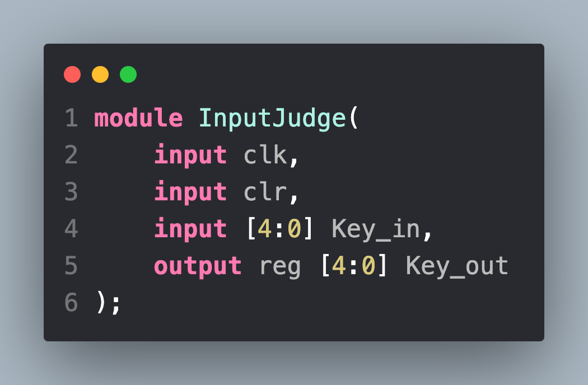
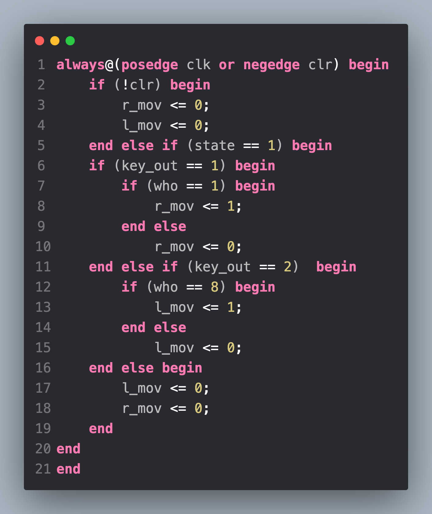

# 流水学号

> by 陈欣杰 计科224

## 主要功能

- 8个数码管全部具有显示和写入双模式

- 利用ego1上的8个数码管滚动显示10位学号

- 利用5个按钮实现10位学号输入

## 细节描述

### 输出模式

- 10位学号（含U）在数码管上滚动。

### 写入模式

- 轻按S2键进入写入模式。
- 进入写入模式后，学号停止滚动，当前写入位进行闪烁。
- 轻按左右键切换当前写入位。在最左（右）端数码管时，会在左（右）显示新的一位，右（左）侧数值被隐藏。到达最高（最低）位时，从最低（最高）位开始循环显示。
- 轻按上下键对当前闪烁位进行数值修改。达到最大值（最小值）时会重置为最小值（最大值）

## 具体实现

下文将逐步从3.1的基本实验改进到最终的八位显示/输出

### 显示模式

#### 一、4个数码管到8个数码管

> 在3.1的实验手册中已经带领我们完成了8位学号的滚动显示，下面将讨论如何将其改为10位的滚动显示，以及如何显示字母U。

#### **修改端口以及传输的线**

> **思考：**

- 我们已经知道了ego1上点亮一个数码管上的一个段既需要片选信号又需要段选信号。若想点亮8个数码管，一个合理的想法就是将top模块中的再增加一对片选和段选信号。

!> 值得注意的是若直接将seg1扩展到8bit是错误的。这是因为在ego1上载有8个共阴极数码管，4个为一组，这4个数码管共用一组段码信号,两组段码信号不可以共用。

- 而点亮8个数码管需要每次给segMsg模块32位的数据。故我们还应该将GPU到segMsg的dataBus修改成32位的。

> **代码修改**

- 添加片选信号pos2和seg2

- 修改所有模块的dataBus的位宽到32bit

##### 对模块内部的修改

> **思考：**

- GPU模块中存储学号的msgArray模块此时显然需要被修改，因为它原来只存储了8位学号，此时应该扩展成存储10位学号的寄存器。并且在数据滚动的代码中也应该改变数据范围。
- dataBus的赋值是在GPU内部实现的，故也应该修改此处的代码使dataBus能获得32bit的数据。
- segMsg模块中添加了新的片选和段选信号，故应该他们编写一段与pos1和seg1类似的代码以实现功能。并且应当添加字母U的显示，不妨在case模块中令10代表字母U。

> 代码修改

- 修改GPU模块中的msgArray的大小和dataBus取得的数据位宽。

- 为segMsg中的pos2和seg2编写类似pos1和seg1的代码。

- 利用dataP2为seg2赋值

?> 以上便完成了从点亮4个数码管到点亮8个数码管的功能添加。

!> 上板运行后发现可能有显示不清晰或者某个数字残缺的情况，这是因为segMsg模块中clk190hz的刷新率太低，可以适当调高，但是过高也会出现一些显示问题。

### 写入模式

#### 一、添加按键功能

> 在一中已经完成了显示模式的全部功能下面应该对写入模式进行设计，想进行模式转换就需要获得从外界输入的信号，所以下面对接收按钮信号进行设计。由于是在之前的模块的基础上添加新的功能，不妨直接设计一个新的模块InputJudge来避免对之前模块的修改。

##### 设计InputJudge模块的端口

> 思考：
> 
- 这个模块需要实现什么样的功能？

在这个模块中需要对输入的key判断是否有按钮被按下，并且将判断后的结果输出。

- 需要时钟和复位信号吗？需要什么频率的时钟？

需要利用时钟信号来检测是否有按钮被按下，并且时钟频率最好高一些，这样的带来的延迟就越少。复位信号的输入是必要的，当复位键被按下，这个模块不应该有任何输出。

- InputJudge模块还需要哪些端口？

应当有一个输入的key_in信号，以及判断后的输出信号key_out。

> 代码实现

- 将5个按钮的信号合并输入模块，并且合并输出。

##### 设计InputJudge的内部实现

> 思考：

- 内部的主要功能？

对输入信号判断是否有按钮被按下。

- 对按钮的一次按压会产生怎样的输出波形？

当被检测到后将一直输出高电平。

- 如何保证一次按压应该只产生一次操作，即只被clk信号踩中一次？

对每次的按压不论时长都产生一个长度与clk一个周期等长的高电平信号。还应当对按键的抖动进行消除，即完全按下后才产生一次脉冲信号。

- 如何消除抖动？

可以设置一个计时器，在按钮按下后计时器就开始计时，当计时器到达特定值后保持。一旦按钮松开计时器就复位。

- 何时产生脉冲信号？

由于计时器到达设定值后会保持，故应该在计时器到达特定值的前一个bit产生脉冲信号以保证只产生一个脉冲信号，这样对计时精度的影响最小。

> 设计思路

当检测到按键按下后，计时器xd_cnt开始计时，在计时器在设定值前一个bit时发出一个脉冲信号指示当前某个按钮被按下。计时完成后若不松开按钮xd_cnt维持在设定值，一旦松开计时器便复位。

> 代码实现

?> 以上完成了InputJudge模块的设计

#### 二、实现选中位闪烁

> 闪烁的本质就是当前位置的数码管在熄灭和亮起之间反复，所以在这里最直接的就是修改segMsg模块的功能。

##### 修改segMsg模块

> 思考：

- 想让当前选中位闪烁需要哪些信息？
  1. 8个数码管中被选中的数码管编号
  2. shine信号控制数码管的亮灭 0表示亮，1表示灭。
  3. state信号表示当前是否处于写入模式 0表示显示模式 1表示写入模式

> 设计思路

- 由上一步的分析易知只有（state == 1 && shine == 1 && who == 当前位置） 时数码管要熄灭。要让数码管熄灭也很简单，当要刷新它的时候给一个低电平而不是高电平。
- 在这个模块中只考虑对输入信号的处理，所有的信号生成都交给后面要设计的控制器模块。

> 代码修改

- 添加信号

- 修改片选信号的输出，以第一位为例

> **代码展示**
> 

#### 三、将GPU中的数据单独存放

> 对选中位数值的改变涉及到对存储在寄存器内的数据的修改，为了让这一步骤更加简单，不如将放在GPU中的数据寄存器单独制作一个模块进行操作。

##### 设计思路

- 设计一个模块dataReg，在其中存放10个4位的寄存器来存储学号数据。编号0～9。
- 利用一根40bit的数据线将dataReg的数据送入GPU。

> 代码实现

- 设计DataReg模块

- 为GPU添加输送数据的线，将之前定义的parameter NUMBER删除便可以让GPU得到DataReg中的数据。

#### 四、让数据在写入模式停止

> 进入写入模式后应该停止数据的滚动，从左边第一位开始闪烁，闪烁功能在之前已经实现，在这一步我们只要让数据停止滚动即可。

> 思考

- 数据的滚动是由于GPU中对msgArray寄存器的高低位转换产生的，那么只要让GPU在写入模式不进行数据滚动就可以了

> 设计思路

- 为GPU模块添加一个state信号，当state信号为1时不再改变msgArray寄存器中的数据顺序。

> 代码实现

- 添加一个if语句即可，在state == 1 时对msgArray进入保持状态

#### 五、在最左（右）端左（右）移时的显示数据的整体移动。

<aside>
💡 这一步的实现非常有趣。以选中位在最右端时，按下左键为例，此时我们希望显示在数码管上的数据每一个都可以显示在右边数码管上，最高位显示被隐藏的数据。我们可以利用上一步GPU在写入模式永远传出的DataReg编号2～9号的寄存器的值这个特点。即此时只要让9号寄存器的到0号寄存器的值，2～8号寄存器应该得到3～9号寄存器的值，就可以实现数据整体移动的功能。左移动同理。

</aside>

> 设计思路

- 让控制器产生左右移动信号l_mov和r_mov，在DataReg中根据得到的信号让寄存器产生相应的动作。

> 代码实现

- 添加输入信号

- 设计组合逻辑

#### 六、对选中位进行加减

> 思考：

- 要对选中位进行加减我们应该在此时向DataReg中传递什么信号？
  1. 加法信号add 减法信号sub
  2. 当前选中位who

> 设计思路

<aside>
💡 利用写入模式时GPU传递给segMsg模块的永远是DataReg中3～10号寄存器的值，我们不难发现要修改的寄存器编号就是who+1。

</aside>

> 代码实现

#### 七、控制器设计

> 由于在写入模式，我们应该根据上下左右四个按键来改变当前写入位和当前位应该改变的值，故不妨设计一个控制器Control来产生控制信号便于后续对于寄存器中数据的处理。

##### Control模块需要产生的控制信号

- 对于当前状态的记录，即当前处于显示模式还是写入模式。 state信号
- 对于当前选中位置的记录。 4位宽的who信号（第一位index为1，故需要4位）
- 对于当前选中位置闪烁状态中亮灭的记录。 shine信号
- 当到达边界需要将未在8个数码管上的值显示出来时的左右移动信号。 l_mov 和 r_mov信号。
- 加减信号。 add和sub信号。

> 代码实现

- Control模块端口设计如下，把各个键值输入后输出各个控制信号。

- 中间键按下时产生状态转换

- 左右键对当前位置进行改变

- 闪烁信号

- 左右移动信号，到达左右边界时候发出左右移动数据的信号。

- 加减信号，上键加，下键减。

?> 完成控制信号的产生

> 全部代码

[https://github.com/Xinjie-Chen/Digital-Logic/tree/main/lab3](https://github.com/Xinjie-Chen/Digital-Logic/tree/main/lab3)
