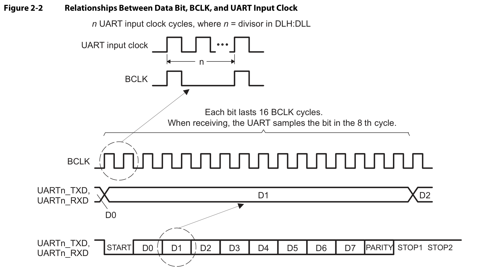
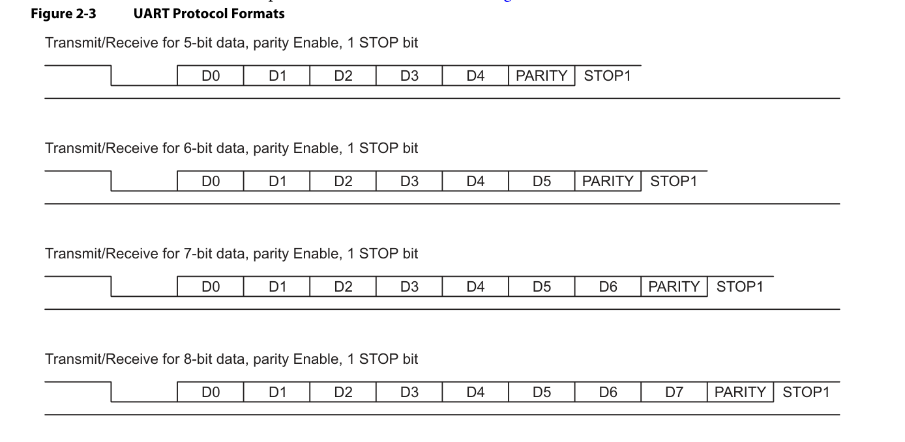

# UART 串口实验

## 实验目的
本实验的目的是了解设备间最常用的硬件通信协议：Universal Asynchronous Receiver/Transmitter，即 UART 的工作原理以及基本收发的实现。这是一种使用异步方式的硬件通信协议，不需要使用时钟信号连接两个设备，而只需要 Transmitter（Tx）与 Receiver（Rx）信号即可进行通信。

下面是 UART 收发的波形图，多个输入时钟信号可以产生一个BCLK，而发送的每个数据位为了准确性考量将会持续 16 个周期。


## 实验内容
1. 参照 UART 手册实现一个 UART 收发模块，其端口定义如下：
    ```verilog
    module UART_RT(
        input  wire         uart_input_clk,
        input  wire         aresetn       ,
        input  wire [ 7: 0] wdata         , // Write Data
        input  wire         wvalid        , // Write Valid
        output wire [ 7: 0] rdata         , // Read Data
        output wire         rvalid        , // Read Valid
        input  wire         rx            , // Receiver
        output wire         tx              // Transmitter
    )   
    endmodule
    ```
    该模块需要做到如下要求：
    - **16** 倍过采样
    - 波特率 **19200**
    - **8** 个数据位
    - **无**奇偶校验位
    - **1** 位停止位
    - 滤波（如实现接收功能需要考虑）


    
    **注意：顶层模块的名称和管脚名称必须和上述模块一致，用于CG线上实验验收**
    
2. 在电脑上使用串口线连接 ego-1，测试 UART 收发模块的正确性。

## 实验要求
1. 实验内容 1、2 的运行结果需要找助教或老师演示验收

2. 在实验报告中提交Verilog代码、仿真代码、顶层模块设计图、综合得到的RTL级实现图、仿真结果波形图、上版结果（开发板和电脑的串口软件同框）。这有些麻烦，但很必要

3. 提交实验报告和源程序压缩包，压缩包要求：

	+ 建立一个以“lab2_学号”命名的文件夹，将实验报告和源代码存放到该文件夹里，例如：`lab_uart_41670043`；

	+ 实验报告命名规则：`lab_uart_学号.docx`, 例如：`lab_uart_41670043.docx`；

	+ 将文件夹压缩后，上传压缩包：`lab_uart_学号.zip`。
  
## 附录 A
[KeyStone Architecture Literature Number: SPRUGP1 Universal Asynchronous Receiver/Transmitter (UART) User Guide](../appendix/uart_doc.pdf ':ignore ')
