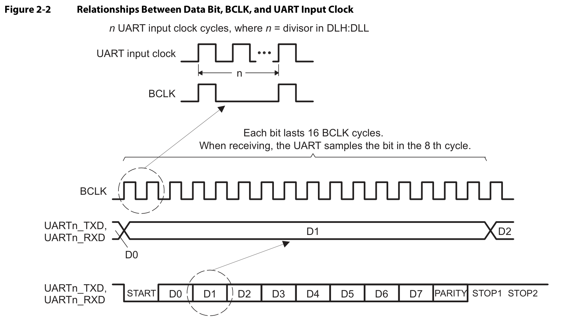
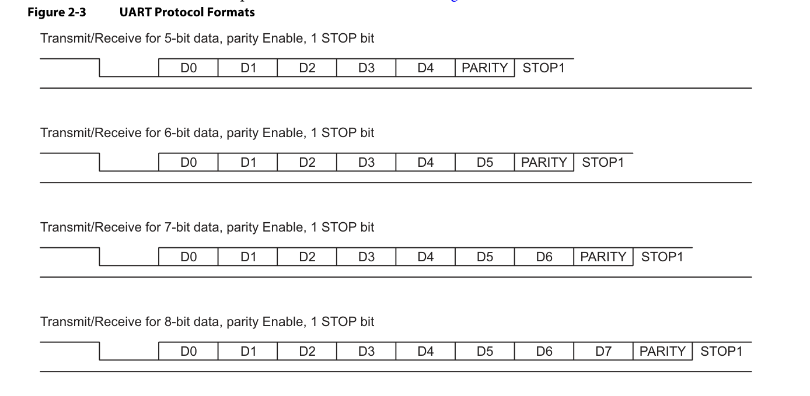
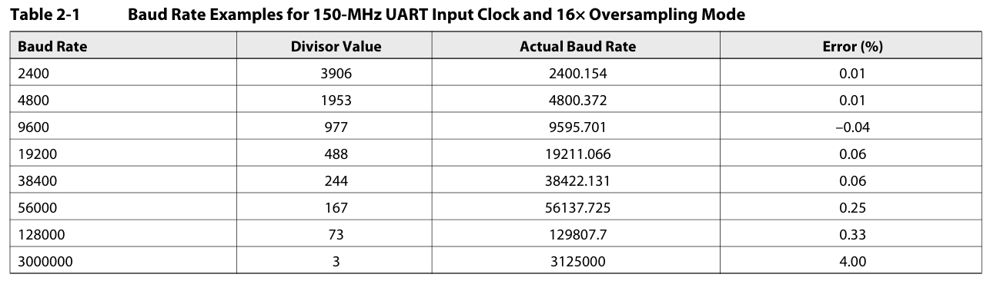

# UART 串口实验

## 实验目的
在本次实验中，大家将会深入了解一种在设备间交流时如鱼得水的硬件通信协议：Universal Asynchronous Receiver/Transmitter，简称 UART。这不仅是一种硬件通信协议，更像是设备间的无声对话。UART 的独到之处在于它的异步特性——它不需要使用时钟信号连接两个设备，只需靠着 Transmitter（Tx）和 Receiver（Rx）两个信号就能愉快地交换信息。就像在闲聊时无需约定时间一样自在，UART 让设备之间的对话变得轻松而高效。我们将通过本实验，揭秘这种看似简单却大有玄机的通信协议，探索其基本的收发机制。

下面是 UART 收发的波形图，多个输入时钟信号可以产生一个BCLK，而发送的每个数据位为了准确性考量将会持续 16 个BCLK（具体是多少个输入的时钟周期请自行计算）。



## 实验内容
1. 参照 UART 手册实现一个 UART 收发模块，其端口定义如下：
    ```verilog
    module uartAdapter(
        input  wire         clk    ,
        input  wire         resetn ,
                
        input  wire         rx     ,
        output wire         tx     ,
    
        input  wire [ 7: 0] wdata  ,
        input  wire         wvalid ,
        output wire [ 7: 0] rdata  ,
        output wire         rvalid
        );
    ```
    + 该模块包含三个子模块`uart_pll`、`uartTransmitter`和`uartReceiver`。`uartTransmitter`和`uartReceiver`端口定义如下：

    ```verilog
    module uartTransmitter(
        input  wire         clk    ,
        input  wire         rst    ,
                
        output reg          tx     ,
    
        input  wire [ 7: 0] wdata  ,
        input  wire         wvalid 
    );
    
    module uartReceiver(
        input  wire         clk    ,
        input  wire         rst    ,
                
        input  wire         rx     ,
    
        output wire [ 7: 0] rdata  ,
        output reg          rvalid
    );
    ```
      + uartAdapter模块需要做到如下要求：

        - **16** 倍过采样
        - 波特率 **19200**
        - **8** 个数据位
        - **无**奇偶校验位
        - **1** 位停止位
        - 滤波（如实现接收功能可以考虑）


      + 当然，从零开始实现一个UART收发模块的难度对于大家可能会略有些高。为了让大家在能够深入理解UART协议的同时，不用花太多的时间在写各种琐碎而基础的代码或是与UART无关错误的debug上，在收到了若干同学提出的宝贵建议后，我们决定**将本次实验所用到的UART收发模块的参考代码直接提供给大家**，大家如果不愿意从零写起，直接使用我们给出的代码即可。
      + 备注：
      	1. 大家在使用我们提供的参考代码中的模块时，可能会发现缺少了一些相关代码，这可能是我们~~有意为之~~*不小心删除的*，请大家根据对UART的理解自行填补。
      	2. 大家在填补完成代码后，可能会发现，虽然填补的代码理论上应当是完全正确的，但该收发模块并不能正常工作。这~~亦是我们有意为之~~*可能是我们不小心写错的*，请大家根据对UART的理解，从代码中找到粗心的我们留下的错误，并将其改正。
      	3. 这些要求与提供的资料是基本对应的，因此可以大大简化难度。

2. 通过已给出的外设控制模块使用正确的UART收发模块，完成上板通信测试。

    + 当然，从零开始实现一个外设控制模块的难度对于大家可能会略有些高。为了让大家在能够深入理解UART协议的同时，不用花太多的时间在写各种琐碎而基础的代码或是与UART无关错误的debug上，我们决定**将本次实验所用到的外设控制模块的参考代码直接提供给大家**，大家如果不愿意从零写起，直接使用我们给出的代码即可。
    + 备注：
    	+ 对于外设模块，我们**并不会**不小心删除代码或是粗心写错代码。

## 实验要求
1. 实验内容 1、2 的运行结果需要找助教或老师演示验收；

2. 在实验报告中提交Verilog代码、仿真代码、顶层模块设计图、综合得到的RTL级实现图、仿真结果波形图、上板结果（开发板和电脑的串口软件同框）。

3. 提交实验报告和源程序压缩包，压缩包要求：

	+ 建立一个以“labx_学号”命名的文件夹，将实验报告和源代码存放到该文件夹里，例如：`labx_U2022418xx`；

	+ 实验报告命名规则：`labx_学号.docx`, 例如：`labx_U2022418xx.docx`；

	+ 将文件夹压缩后，上传压缩包：`labx_学号.zip`。
  

  
## 附录 A
[UART Receiver.v](../codes/uart/UART_Receiver.v ':ignore ')
[UART Transmitter.v](../codes/uart/UART_Transmitter.v ':ignore ')




[KeyStone Architecture Literature Number: SPRUGP1 Universal Asynchronous Receiver/Transmitter (UART) User Guide](../appendix/uart_doc.pdf ':ignore ')

UART模块框图
