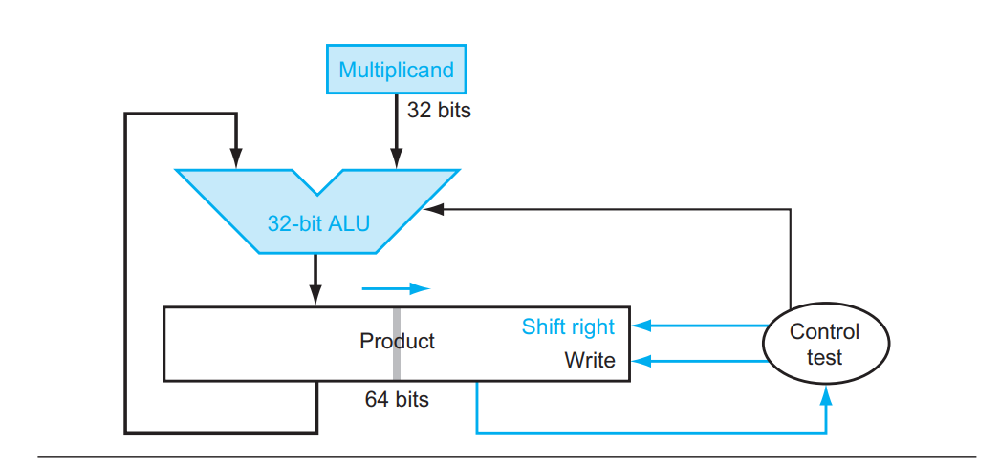

# 无符号乘法器设计

> by Zakilim

### 无符号乘法运算基础

在考虑乘法器的设计之前，我们首先可以考虑乘法的运算。在10进制下，我们往往会用下面的方式计算乘法
$$
\begin{aligned}
	&1234\\
\times&1221\\
\hline
&1234\\
2&468\\
24&68\\
123&4\\
\hline
150&6714
\end{aligned}
$$
在二进制的情形下，我们其实可以采用同样的方式进行运算。可以证明

对于两个二进制数,采用位向量(bit vector)的方式写出来就是$\vec{x}={(x_{w-1},...x_1,x_0)}$，$\vec{y}={(y_{w-1},\cdots ,y_1,y_0)}$，对于一个位向量，若其表示一个无符号数，其数值为$x  =\sum_{k=0}^{w-1}x_{k}2^{k}$

那么两个二进制数的乘积就是

$$\begin{aligned}x\times y&= (\sum_{k=0}^{w-1}x_{k}2^{k})(\sum_{k=0}^{w-1}y_{k}2^{k})\\
&=\sum_{k=0}^{w-1}y_k2^k(\sum_{l=0}^{w-1}x_{l}2^{l})\\
&=\sum_{k=0}^{w-1}(y_k2^k\times x)\end{aligned}$$

由于二进制下，$y_k \in \{0,1\}$，因此$y_k$的作用就像是选择器，决定这外侧和式的每一项是否为0，对于$2^k$的计算，事实上就是一个简单的移位运算，在低位补上$k$个$0$。从这个式子我们可以得到下面的计算方法
$$
\begin{aligned}
&(11101)_2\\
\times&(10001)_2\\
\hline
&(11101)_2\\
(&000000)_2\\
(0&000000)_2\\
(00&000000)_2\\
(111&010000)_2\\
\hline
(111&101101)_2
\end{aligned}
$$
可以看到，采用二进制竖式运算，较之十进制其实更简单，实际上是一种加法和移位的组合运算。

### 循环移位乘法器

正如前文给出的公式$xy = \sum_{k=0}^{w-1}(x\times y_k2^k)$

如果我们对其稍加改造，利用高中学过的秦九韶算法对上式进行一个简单的变形
$$
\begin{aligned}
xy &= \sum_{k=0}^{w-1}(x\times y_k2^k)\\
&=x\times y_{w-1}2^{w-1} + x\times y_{w-2}2^{w-2}+\cdots+x\times y_02^0\\
&=(...((x\times y_{w-1})\times2 +(x\times y_{w-2}))\times2)...)\times 2 + x\times y_0
\end{aligned}
$$
或者
$$
\begin{aligned}
xy &= \sum_{k=0}^{w-1}(x\times y_k2^k)\\
&=x\times y_{w-1}2^{w-1} + x\times y_{w-2}2^{w-2}+\cdots+x\times y_02^0\\
&=((...((x\times y_{0})\times2^{-1} +(x\times y_{1}))\times2^{-1})...)\times 2^{-1} + x\times y_{w-1})\times 2^{w-1}
\end{aligned}
$$


那么乘法的运算方式就可以用以下的伪代码描述

```python
BitVector x,y
sum = 0
for i from len(y) - 1 to 0:
	sum <<=1
    sum += y[i]*x
return sum
```

或者

```python
BitVector x,y
sum = 0
x <<= len(y)
for i from 1 to len(y)-1:
	sum += y[i]*x
    sum >>=1
return sum
```


这就是循环移位乘法器的设计原理，其实现的其中一种原理图如下



 这张图片是《计算机组成与设计：硬件软件接口》一书中的插图，该图描述了一个32位数和另一个32位数的乘积。这种方式的实现依据是我们上图中的第二种伪码

在初始状态下，乘积用一个64bit的寄存器存放，高32位的寄存器被置零，低32位存放乘数。

每次选择乘积寄存器的**高32位与被乘数相加**，根据**最低位的为0或1**判断是否需要写入乘积寄存器当中，（也就是决定加还是不加），然后整体右移，（加法时记得保留进位）。当乘积寄存器右移32位以后，乘积寄存器当中就存放了64位的无符号乘积，此时初始状态下存放的被乘数在32位移位中就逐渐被抛掉了。这种乘法器的设计比较节约寄存器的大小，如果觉得实现较为困难，也可以单独建立一个乘数寄存器来存放乘数控制电路。

### 阵列乘法器

前面的循环移位乘法器需要多个时钟周期才能完成，事实上，我们也可以采用组合逻辑实现，既然乘法不过是加法与移位的组合，那么对于一个n位数，只要有n个n位加法器同时工作，就可以在一个周期内计算出结果。一个n位加法器需要n个全加器实现，那么n位阵列乘法器，就需要n*n个全加器组和到一起,其中一种电路实现描述如下


事实上，在这个过程中，还可以通过超前进位加法器来加速运算。