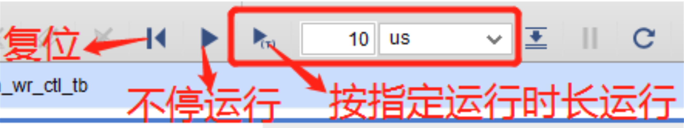

# 问题汇总

1. Vivado崩溃后C盘被占满，再次运行时无法运行

    清除如下文件夹中的所有文件：

    ```
    C:\Users\<你的用户名>\AppData\Local\Temp
    ```

    并清空回收站。

    * 如果仍然不行的话，可以借同学的设备或到机房电脑上做实验；

2. 仿真无法看到正确波形

    考虑如下可能：

    * 仿真时长不够：

        

        在此处设置运行时长，直到大于`tb`文件中指定的运行时长。

    * 仿真速度太慢

        可以将`tb`文件的第一行改为：

        ```verilog
        `timescale 1ns / 1ns
        ```

    * 程序逻辑有问题

        检查程序逻辑，必要时应测试多个模块直到找到问题。

3. 生成比特流失败

    * 检查是否已经`Synthesis`和`implementation`；
    * 检查是否已经分配所有管脚：
        * 在`implementation`完成后点击`open implementation design`界面，随后点击页面最上方的`Layout -> IO Planning`打开管脚分配界面，在其中分配所有管脚，程序中用到的管脚全部要分配，一个都不能少。

# 验收要求

* Q：可以拍一个视频验收吗？

    A：不可以。验收过程不仅需要看现象，还需要考察一些问题，因此最好不要使用视频验收的方式。如果在自己的电脑上没有相应条件的话，最好能够在上课的时候在机房电脑上做实验并在课上验收。